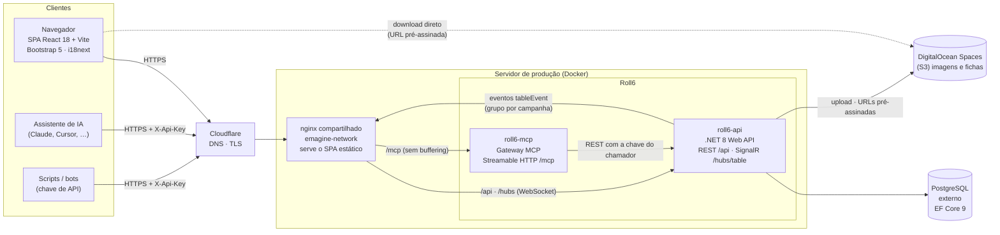
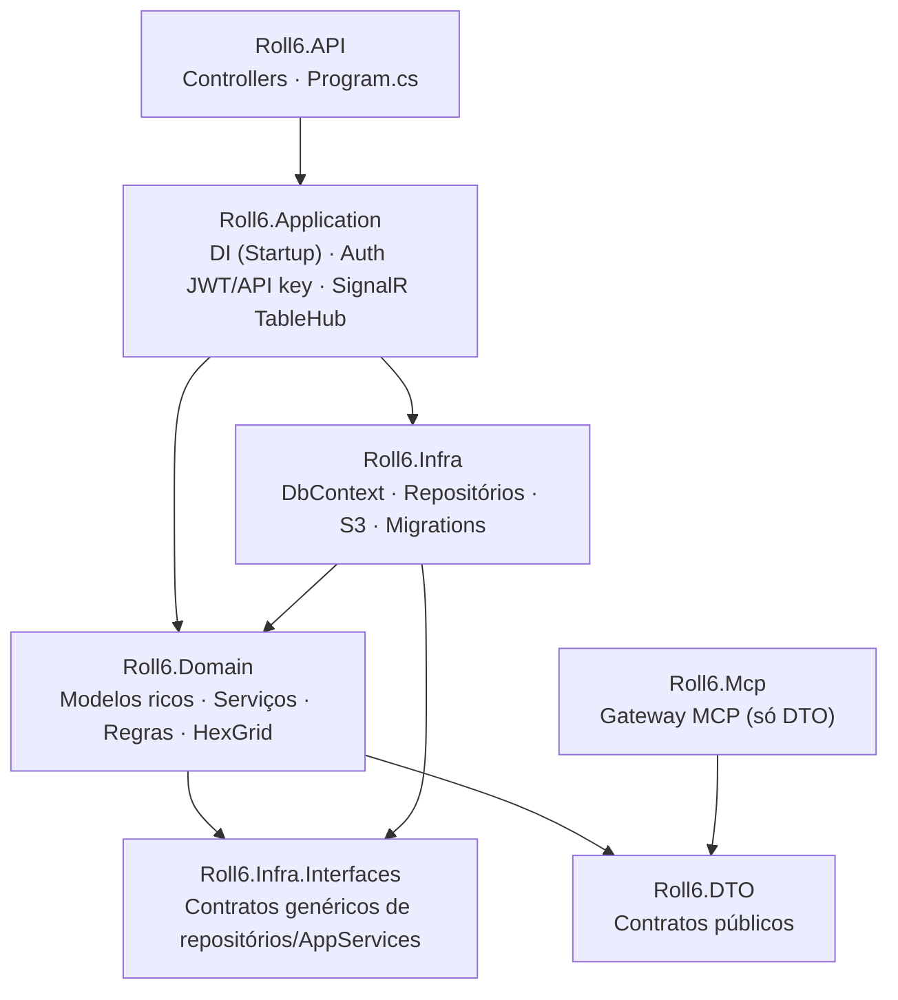
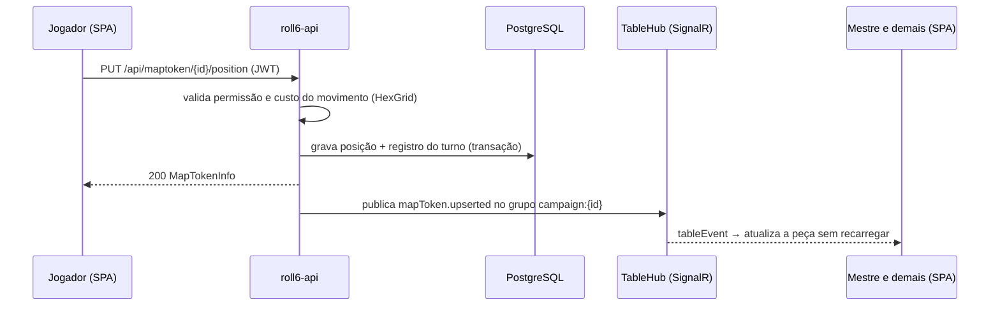

# Roll6

RPG Tabletop for GURPS — uma mesa virtual **simples**, no estilo Roll20, para jogar campanhas em mapas com grid
hexagonal.

O mestre cria campanhas e mapas, sobe as imagens de fundo e posiciona as peças; os jogadores entram com seus
personagens, movem suas peças no hex, agem no turno e acompanham tudo em tempo real. Assistentes de IA podem operar a
mesa pela API via um servidor MCP.

## Funcionalidades

- **Contas e acesso** — cadastro/login local (JWT) e chaves de API por usuário (`X-Api-Key`), com expiração e revogação.
- **Campanhas** — abertas ou fechadas; o mestre convida personagens ou aprova pedidos de acesso; plano da campanha em
  markdown com imagens (só o mestre vê).
- **Mapas** — modelos de mapa com imagem de fundo ajustável sob um grid hexagonal *flat-top* (odd-q), seguindo os
  algoritmos da [Red Blob Games](https://www.redblobgames.com/grids/hexagons/); cada campanha tem os seus mapas e o
  "mapa atual" que os jogadores acompanham.
- **Peças** — personagens, NPCs (cada ocorrência com vida/energia próprias) e objetos; movimento com custo por passo e
  por giro de 60°, calculado por BFS sobre (hex, direção).
- **Personagens** — ficha em markdown e ficha em arquivo (imagem ou PDF), vida/energia totais e atuais por campanha,
  status, token próprio; podem ser transferidos para outro usuário mantendo campanhas, peças e turnos.
- **Turnos** — um movimento e uma ação por turno, rastros e balões no mapa, "Finalizar turno" do mestre com resumo e
  notificação.
- **Tempo real** — SignalR empurra as mudanças para todos na campanha; sem conexão, o app volta ao polling.
- **MCP** — todas as operações da API expostas a assistentes de IA, com descrições detalhadas e um guia do domínio.

## System design



### Camadas do backend



### Fluxo de uma alteração na mesa



Pontos principais:

- **Mesma origem**: o SPA chama `/api` no próprio domínio; o nginx encaminha para a API — não há CORS fora do
  desenvolvimento.
- **Tempo real só servidor → cliente**: toda escrita passa pela REST; os serviços de domínio publicam o evento depois
  que a gravação deu certo.
- **MCP sem segredos**: o gateway não acessa banco nem storage; cada ferramenta é uma chamada REST com a chave do
  próprio usuário, então permissões, validações e eventos são os da API.
- **Arquivos**: o banco guarda só `{guid}.{ext}`; as leituras devolvem URLs pré-assinadas que expiram.

## Stack

| Parte | Tecnologias |
|---|---|
| Backend | C# 12 / .NET 8, ASP.NET Core Web API, EF Core 9 + Npgsql, JwtBearer, SignalR, AWSSDK.S3, Swashbuckle |
| MCP | `ModelContextProtocol.AspNetCore` (Streamable HTTP) |
| Frontend | React 18, TypeScript 5, Vite 6, React Router 6, Bootstrap 5.3 (tema escuro), i18next, sonner, Radix UI, `@microsoft/signalr` |
| Dados | PostgreSQL (snake_case, sem cascata), DigitalOcean Spaces (S3) |
| Testes | xUnit + Moq + FluentAssertions, Vitest |
| Infra | Docker Compose, nginx, Cloudflare, GitHub Actions (deploy, GitVersion, releases) |

## Estrutura do repositório

```text
backend/            Solução .NET (Roll6.sln)
  Roll6.API           Controllers e startup da API
  Roll6.Application   Injeção de dependências, autenticação, SignalR
  Roll6.Domain        Modelos, serviços, regras e matemática do grid hexagonal
  Roll6.Infra         EF Core (DbContext, repositórios, migrations) e S3
  Roll6.Infra.Interfaces, Roll6.DTO
  Roll6.Mcp           Servidor MCP (gateway para a API)
  Roll6.Tests         Testes unitários
frontend/           SPA React (src/Contexts, Services, hooks, types, components, lib)
database/           roll6.sql (esquema completo) e migrations/ (scripts incrementais)
bruno/              Coleção de requisições da API (Bruno)
specs/              Especificações de cada feature (Spec Kit)
docker-compose.yml  Homologação · docker-compose-prod.yml  Produção
```

## Rodando localmente

Pré-requisitos: .NET 8 SDK, Node.js 20+, um PostgreSQL acessível e credenciais de um bucket S3/Spaces (as leituras
geram URLs pré-assinadas).

### Backend

```bash
cd backend
cp Roll6.API/appsettings.Template.json Roll6.API/appsettings.Development.json   # preencha banco, JWT e S3
dotnet ef database update --project Roll6.Infra --startup-project Roll6.API
dotnet run --project Roll6.API        # http://localhost:5119 — Swagger em /swagger
dotnet run --project Roll6.Mcp        # opcional: MCP em http://localhost:5129/mcp
dotnet test
```

As credenciais do S3 vêm das variáveis padrão da AWS (`AWS_ACCESS_KEY_ID`, `AWS_SECRET_ACCESS_KEY`).

### Frontend

```bash
cd frontend
cp .env.example .env.local            # VITE_API_URL vazio: o Vite faz proxy de /api, /hubs e /mcp
npm install
npm run dev                           # http://localhost:5173
npm test && npm run lint && npm run build
```

## Banco de dados

- `database/roll6.sql` cria o esquema completo e é idempotente (pode ser rodado em banco vazio ou parcialmente
  migrado).
- `database/migrations/*.sql` contém só as alterações de cada release, para aplicar manualmente.
- Em homologação e produção a API aplica as migrations ao iniciar (`Database:ApplyMigrationsOnStartup`).

## Ambientes e deploy

| | Desenvolvimento | Homologação | Produção |
|---|---|---|---|
| Execução | `dotnet run` + `npm run dev` | `docker-compose.yml` (api, mcp, web, db) | `docker-compose-prod.yml` (api, mcp) |
| Configuração | `appsettings.Development.json` | `.env` (modelo `.env.example`) | `appsettings.Production.json` + secrets do GitHub |
| HTTPS | certificado de dev | — | Cloudflare + nginx do servidor |

O workflow `deploy-prod.yml` roda a cada push na `main` (ou manualmente): conecta por SSH, gera o `.env.prod` a partir
dos secrets e sobe os containers. Secrets necessários: `PROD_SSH_HOST`, `PROD_SSH_USER`, `PROD_SSH_PASSWORD`,
`PROD_SSH_PORT` (opcional), `ROLL6_CONNECTION_STRING`, `ROLL6_JWT_SECRET`, `AWS_ACCESS_KEY_ID`,
`AWS_SECRET_ACCESS_KEY`. As tags de versão (`vX.Y.Z`) e as releases são geradas pelo GitVersion.

## Usando o MCP

1. No Roll6, abra o menu do usuário → **Chaves de API** e gere uma chave (`r6_…`).
2. Cadastre o servidor no seu assistente, por exemplo no Claude Code:

   ```bash
   claude mcp add --transport http roll6 https://<seu-domínio>/mcp --header "X-Api-Key: r6_SUA_CHAVE"
   ```

3. Peça ao assistente para ler o guia (`get_roll6_guide`) e listar suas campanhas.

A chave tem o mesmo acesso do seu usuário; crie uma por assistente para poder revogá-las separadamente.

## Licença

[MIT](LICENSE) © 2026 Rodrigo Landim Carneiro
