# Manual: como criar os sprites 2,5D do seu personagem

Este manual mostra, passo a passo, como transformar **uma arte de personagem** em **quatro imagens** (frente, direita, esquerda e costas) para que o seu token apareça, na vista **3D** do Roll6, mostrando o lado certo conforme a câmera se move ao redor dele. É o mesmo truque dos monstros do Doom: um desenho plano que muda conforme o ângulo em que você o vê.

O exemplo usado é o **Sir William**, um cavaleiro de armadura e capa azul.

| Frente | Direita | Esquerda | Costas |
|:---:|:---:|:---:|:---:|
| 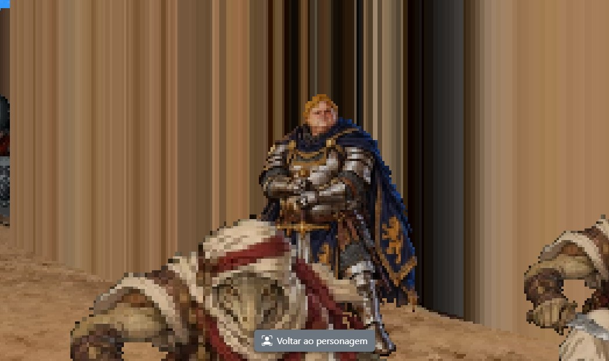 | 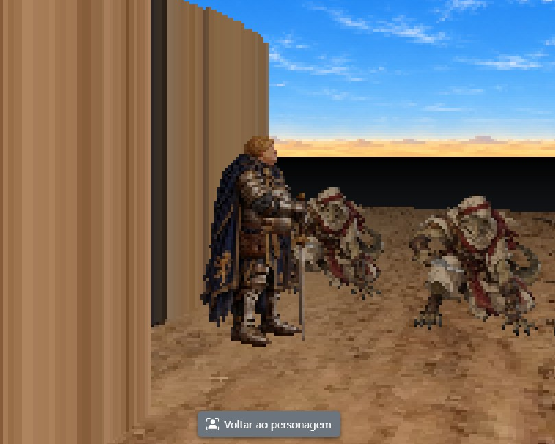 | 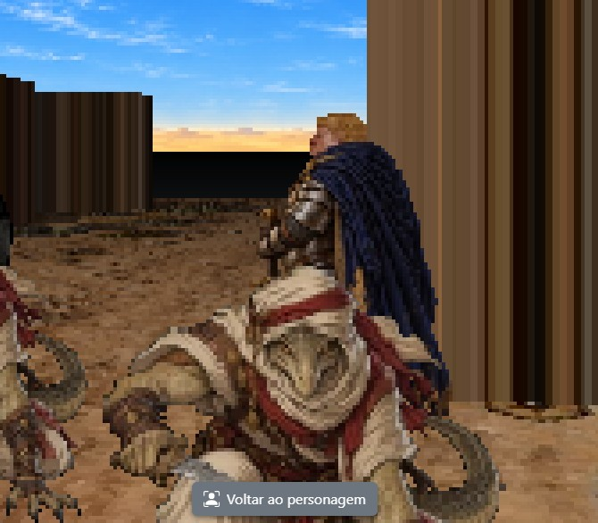 | 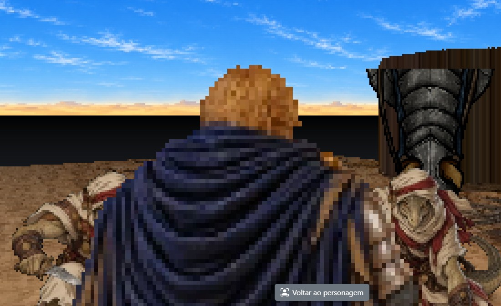 |

## Sumário

- [Como funciona](#como-funciona)
- [O que você precisa](#o-que-você-precisa)
- [Passo 1: a arte de frente](#passo-1-a-arte-de-frente)
- [Passo 2: gerar o modelo 3D no Tripo](#passo-2-gerar-o-modelo-3d-no-tripo)
- [Passo 3: capturar os quatro lados](#passo-3-capturar-os-quatro-lados)
- [Passo 4: deixar o fundo transparente](#passo-4-deixar-o-fundo-transparente)
- [Passo 5: cadastrar as imagens no Roll6](#passo-5-cadastrar-as-imagens-no-roll6)
- [Passo 6: ver o resultado no 3D](#passo-6-ver-o-resultado-no-3d)
- [Quais imagens são obrigatórias](#quais-imagens-são-obrigatórias)
- [Dicas de qualidade](#dicas-de-qualidade)
- [Problemas comuns](#problemas-comuns)
- [Resumo rápido](#resumo-rápido)

---

## Como funciona

Cada token pode ter **quatro imagens 2,5D**, todas opcionais:

| Imagem | Como desenhar | Quando o 3D mostra |
|---|---|---|
| **Frente** | personagem de pé, visto de frente | a câmera está **diante** do personagem (de onde ele olha) |
| **Direita** | personagem de pé, **de perfil, olhando para a direita da imagem** (vemos o lado direito dele) | a câmera está do **lado direito** dele |
| **Esquerda** | personagem de pé, **de perfil, olhando para a esquerda da imagem** (vemos o lado esquerdo dele) | a câmera está do **lado esquerdo** dele |
| **Costas** | personagem de pé, visto de costas | a câmera está **atrás** dele |

"Direita" e "esquerda" são sempre os lados **do próprio personagem**, não de quem olha.

Três coisas para guardar:

- A **direção** do personagem é a que a peça tem no mapa: se você gira a peça no 2D, o 3D passa a mostrar outro lado dela.
- Na vista 3D padrão a câmera fica **atrás do seu personagem**. Por isso você vê as **costas** dele, e a **frente** dos personagens que estão virados para você.
- Peças **caídas** ou **fora de combate** não aparecem no 3D (só figuras em pé aparecem).

> **Não confunda com a imagem do token no mapa 2D.** O token do mapa é visto **de cima** (como o da imagem abaixo, o campo "Imagem em pé" da aba "Token"). Os sprites 2,5D são vistos **de lado, em pé**, e só aparecem na vista 3D.
>
> 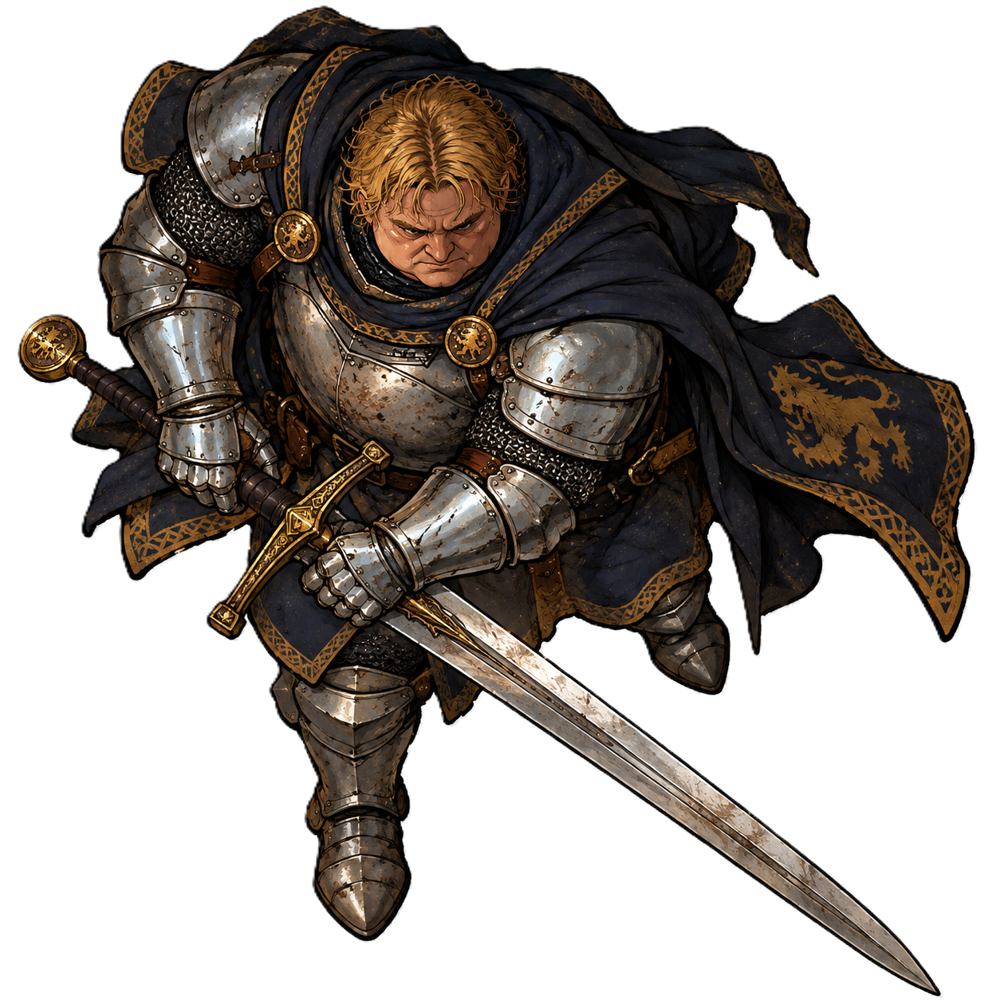

---

## O que você precisa

- Uma **arte do personagem de corpo inteiro, de frente** (o exemplo é `sir-william-frontal.png`).
- Uma conta no **Tripo** (serviço que gera um modelo 3D a partir de uma imagem). A geração consome créditos: na tela do exemplo a geração custa 55.
- Um jeito de **tirar capturas de tela** (no Windows: `Win` + `Shift` + `S`).
- O **ChatGPT** (ou outro editor de imagem) para deixar o fundo das capturas **transparente**.
- O token do personagem **já cadastrado** no Roll6, e você como **criador** dele (só o criador edita um token).

Tempo estimado: 20 a 30 minutos para o primeiro personagem.

---

## Passo 1: a arte de frente

Escolha, ou crie, uma arte do personagem **de pé, de corpo inteiro, de frente**:

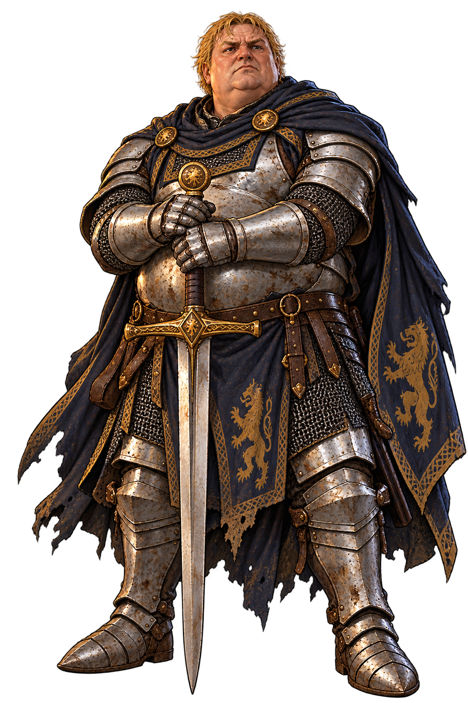

O que torna uma boa arte de partida:

- **Corpo inteiro**, com os **pés** à vista: o personagem é apoiado no chão pela borda de baixo da imagem.
- **Pose neutra e simétrica**, braços junto ao corpo ou em posição simples. Poses muito abertas ou em movimento geram modelos 3D estranhos.
- **Sem objetos grandes soltos** (capas voando, armas enormes para o lado): o modelo 3D vira esses detalhes de forma imprevisível.
- Fundo simples. Não precisa ser transparente nesta etapa.

---

## Passo 2: gerar o modelo 3D no Tripo

1. Entre na página inicial do Tripo (**Home**).
2. Envie a arte do Passo 1 (arraste o arquivo ou escolha-o). A miniatura aparece na caixa de geração.
3. Mantenha **Best Quality** e clique em **Generate** (o botão mostra o custo em créditos, **55** no exemplo).

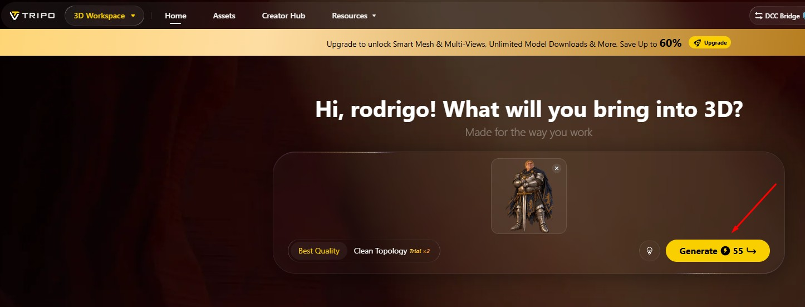

Quando terminar, o Tripo abre o **3D Workspace** com o modelo, já visto de frente. A imagem enviada fica na coluna da esquerda.

> O Tripo também oferece **Generate Multi-Views**, que aparece marcado como recurso de assinantes. **Você não precisa dele** para este método: a rotação do modelo, no próximo passo, já dá todos os lados.

---

## Passo 3: capturar os quatro lados

Com o modelo gerado, você vai **girar o modelo** e **capturar a tela** em quatro posições.

### 3.1 A frente

Deixe o modelo de frente (é como ele abre) e enquadre o personagem **inteiro**, do cabelo aos pés. O **quadro vermelho** da imagem mostra a área que você deve capturar:

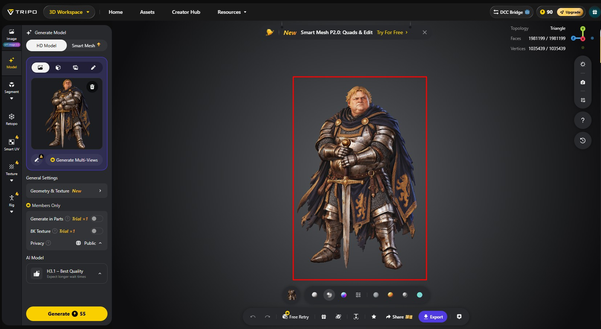

### 3.2 Os lados e as costas

Para girar o modelo, **arraste-o** com o mouse, ou use o **indicador de eixos** do canto superior direito da tela do Tripo (a seta vermelha na imagem aponta para ele). Gire até ficar de perfil:

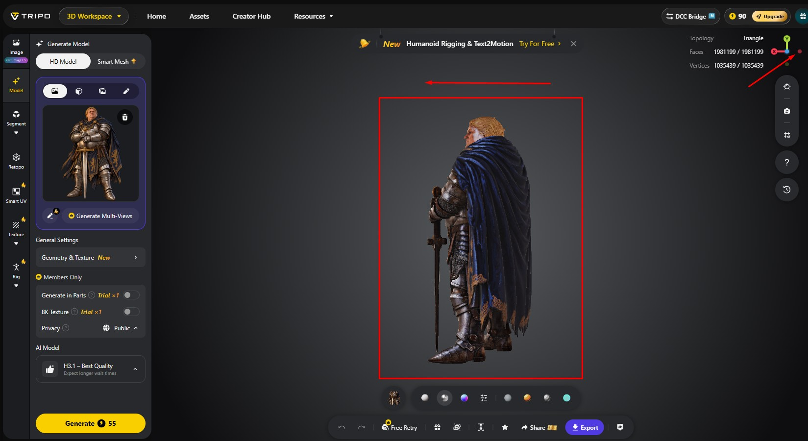

Repita para obter as quatro capturas:

| Captura | Como o personagem deve aparecer |
|---|---|
| **Frente** | de frente |
| **Esquerda** | de perfil, **olhando para a esquerda da imagem** (como na imagem acima) |
| **Direita** | de perfil, **olhando para a direita da imagem** (gire o modelo meia-volta) |
| **Costas** | de costas |

Para a captura ficar boa:

- **Mesma distância e mesmo zoom nas quatro.** Assim o personagem tem o mesmo tamanho em todas, e o 3D não "dá um pulo" quando você anda ao redor dele.
- **Corpo inteiro e pés visíveis** em todas, com o personagem **centralizado**.
- Capture um retângulo **mais alto que largo**, parecido com o quadro vermelho do exemplo (as imagens do Roll6 são retratos 3:4).
- Salve cada uma com um nome claro: `frente`, `esquerda`, `direita`, `costas`.

---

## Passo 4: deixar o fundo transparente

As capturas saem com o **fundo cinza** do Tripo. No 3D, esse fundo precisa sumir, senão o personagem aparece dentro de um retângulo cinza. Faça isso com o ChatGPT:

1. Abra uma conversa no ChatGPT e **anexe a captura**.
2. Peça: **"Gere encima dessa imagem, mas com fundo transparente"**.
3. Quando a imagem voltar, **baixe-a** como PNG.

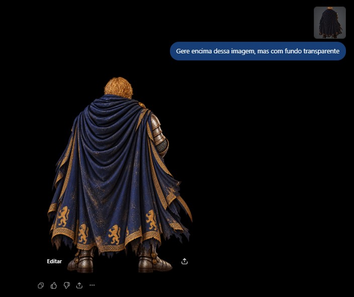

Repita para **cada uma das quatro imagens**, inclusive a da frente (a arte do Passo 1 tem fundo escuro, então também precisa passar por aqui).

Como conferir o resultado:

- Abra o PNG num visualizador de imagens: o fundo deve aparecer como um **xadrez cinza e branco** (é assim que a transparência é mostrada), como no token do Passo 1.
- **Compare com a captura original.** O ChatGPT redesenha a imagem e pode mudar a pose, as proporções ou os detalhes (a capa, a espada). Se ficou diferente, peça de novo.
- Cuidado com **bordas claras ou escuras** (halo) ao redor do personagem: peça de novo ou limpe a borda num editor.

Formatos aceitos pelo Roll6: **PNG, JPEG ou WebP**, até **10 MB** cada. Use **PNG**, para guardar a transparência.

---

## Passo 5: cadastrar as imagens no Roll6

### 5.1 Abrir o token para edição

1. Na mesa, **clique no hexágono** da peça do personagem. Abre o menu da peça.
2. Escolha **Alterar token**.

   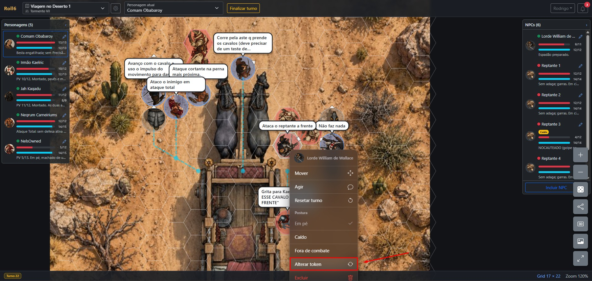

3. Na janela **Tokens**, aba **Meus Tokens**, clique no **lápis** do seu token. Abre a janela **Editar token**.

### 5.2 A aba 2,5D

A janela tem duas abas: **Token** (nome, descrição, imagem em pé e deitada, tamanhos) e **2,5D**. Abra a aba **2,5D**: ela tem os quatro campos, **Frente**, **Direita**, **Esquerda** e **Costas**.

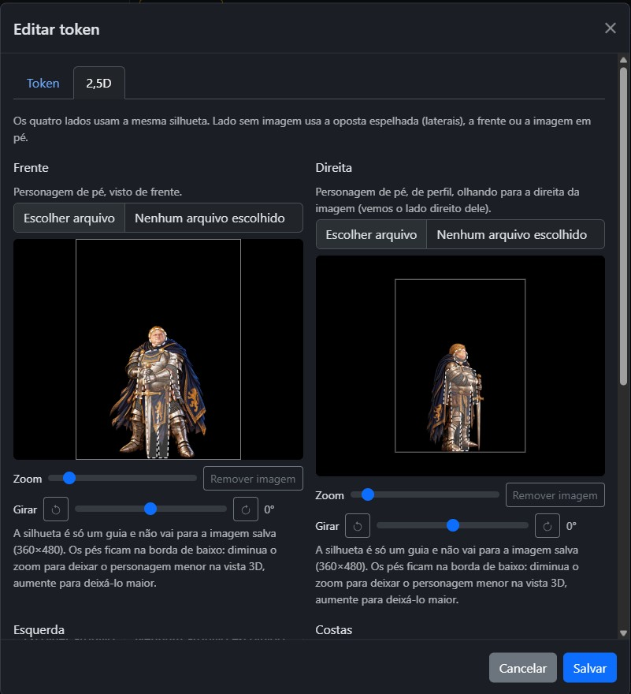

> Em cada campo, confira a frase embaixo do nome: ela diz como o personagem deve estar. Em **Direita** vai a imagem em que o personagem **olha para a direita**; em **Esquerda**, a que ele **olha para a esquerda**. A captura acima serve só para mostrar a tela.

### 5.3 Enviar e ajustar cada imagem

Para **cada um dos quatro campos**:

1. Clique em **Escolher arquivo** e selecione o PNG com fundo transparente.
2. A imagem abre num **recorte** com uma **silhueta humana** (contorno tracejado). Ajuste:
   - **Arraste** a imagem para posicionar o personagem **dentro da silhueta**.
   - Use **Zoom** para a altura do personagem **coincidir com a da silhueta**: a cabeça perto da cabeça da silhueta e os **pés tocando a borda de baixo** do quadro.
   - Use **Girar** só se a captura estiver torta.
3. Faça o **mesmo enquadramento nos quatro campos**: ajuste a **Frente** primeiro e depois deixe as outras com o personagem do mesmo tamanho e no mesmo lugar da silhueta.

Sobre a silhueta:

- Ela é **só um guia**: não vai para a imagem salva.
- Ela ocupa **60% da altura** do quadro, centralizada, com os pés na borda de baixo. O resto do quadro é margem, que fica transparente.
- Um personagem **menor** que a silhueta aparece **menor** no 3D (diminua o zoom); **maior**, aparece **maior** (aumente o zoom). É assim que você ajusta a altura do personagem em relação às paredes.
- Os **pés ficam sempre na borda de baixo**: é nela que o 3D apoia a figura no chão.

Quando os quatro campos estiverem prontos, clique em **Salvar**. Para trocar ou tirar uma imagem depois, volte a **Editar token**; **Remover imagem** só afeta aquele campo.

---

## Passo 6: ver o resultado no 3D

No canto direito da mesa, clique no botão **3D** (a seta vermelha da imagem aponta para ele). A vista 3D ocupa o fundo da tela.

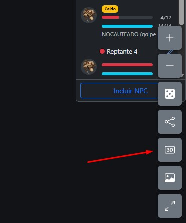

Para ver os quatro lados:

- **Ande ao redor** do personagem com a câmera: a imagem troca conforme o lado em que você está em relação à direção para onde ele está virado.
- **Gire a peça** no mapa 2D e volte ao 3D: a imagem mostrada muda junto com a nova direção.
- Se você se afastou do seu personagem, o botão **Voltar ao personagem** traz a câmera de volta para trás dele.

| O que a câmera vê | Imagem mostrada |
|---|---|
|  | **Frente** |
|  | **Direita** (ele olha para a direita) |
|  | **Esquerda** (ele olha para a esquerda) |
|  | **Costas** |

---

## Quais imagens são obrigatórias

**Nenhuma.** O token continua funcionando com qualquer combinação. Quando falta a imagem do lado que a câmera vê, o Roll6 escolhe, nesta ordem:

1. Se falta a **direita** ou a **esquerda** e existe a lateral **oposta**: usa a oposta **espelhada**.
2. A imagem de **frente**.
3. A **imagem em pé** do token (a que já existia antes dos sprites).

As **costas nunca são espelhadas** a partir da frente: sem a imagem das costas, por trás aparece a frente.

Para escolher quanto trabalho fazer:

| Conjunto | Resultado |
|---|---|
| Só a **Frente** | o personagem aparece sempre de frente, de qualquer lado |
| **Frente + Costas + uma lateral** | gira de forma convincente: a outra lateral é a mesma imagem espelhada |
| **As quatro** | recomendado; use quando houver detalhes que não são simétricos (uma espada na mão direita, uma cicatriz) |

> **Atenção ao espelhamento:** com só uma lateral, o lado oposto mostra a mesma imagem **espelhada**, então um detalhe assimétrico (a espada, por exemplo) aparece trocado de mão. Se isso importa, cadastre as duas laterais.

---

## Dicas de qualidade

- **Mesmo tamanho nas quatro imagens.** É o erro mais comum: se uma imagem tem o personagem maior que outra, ele "cresce" ou "encolhe" quando a câmera passa de um lado para o outro.
- **Pés na borda de baixo.** Sobrar espaço embaixo faz o personagem **flutuar** acima do chão.
- **Corpo inteiro dentro do quadro.** Nada cortado: cabeça, capa e pés devem caber.
- **Fundo realmente transparente**, sem sombras no chão nem molduras.
- **Formas simples e contraste claro.** O 3D desenha em baixa resolução, com aparência "pixelada" de jogo antigo: detalhes muito finos se perdem.
- **Mesma iluminação e mesmas cores** nas quatro, para que o personagem pareça o mesmo.
- **Capa e armas do mesmo jeito** em todos os lados: se a capa aparece de um jeito na frente e de outro nas costas, a troca de imagem fica evidente.
- **Teste no 3D** com a câmera dando a volta no personagem antes de passar para o próximo.

---

## Problemas comuns

| O que aconteceu | Causa provável | O que fazer |
|---|---|---|
| O personagem **flutua** acima do chão | sobra espaço embaixo do personagem na imagem | em **Editar token**, na aba **2,5D**, ajuste o recorte para os **pés tocarem a borda de baixo** |
| O personagem está **gigante** ou **minúsculo** no 3D | zoom do recorte diferente da silhueta | ajuste o **Zoom** para a altura do personagem coincidir com a da silhueta |
| O personagem **muda de tamanho** ao dar a volta | as quatro imagens têm enquadramentos diferentes | refaça os recortes com o personagem do mesmo tamanho nas quatro |
| Aparece um **retângulo cinza ou preto** em volta do personagem | a imagem não tem fundo transparente | refaça o Passo 4 e confira o xadrez no visualizador |
| O lado está **trocado** (a esquerda aparece onde deveria ser a direita) | imagem no campo errado | em **Direita**, coloque a imagem em que ele **olha para a direita**; em **Esquerda**, para a esquerda |
| Um lado aparece **espelhado** | falta a imagem daquele lado e existe a oposta | cadastre a imagem do lado que falta |
| Por trás aparece a **frente** | não há imagem das costas | cadastre a imagem das costas |
| O personagem **não aparece** no 3D | está **caído** ou **fora de combate** | levante a peça (postura **Em pé**) |
| O 3D usa a imagem do **token do mapa** (vista de cima) | o token não tem nenhuma imagem 2,5D | cadastre ao menos a **Frente** |
| Não consigo editar o token | você não é o criador dele | só o criador altera um token; peça a ele ou crie um token seu |
| Arquivo recusado | formato ou tamanho | use PNG, JPEG ou WebP de até 10 MB |

---

## Resumo rápido

1. Tenha uma **arte de frente, corpo inteiro**.
2. No **Tripo**, envie a arte e clique em **Generate**.
3. **Gire o modelo** e capture **frente, esquerda, direita e costas**, na mesma distância, com o corpo inteiro.
4. No **ChatGPT**, peça **"Gere encima dessa imagem, mas com fundo transparente"** para cada captura e baixe os PNG.
5. No Roll6: clique na peça → **Alterar token** → lápis do token → aba **2,5D**.
6. Em cada campo: **Escolher arquivo**, encaixe o personagem na **silhueta** (pés na borda de baixo, mesmo tamanho nos quatro) → **Salvar**.
7. Botão **3D** e dê a volta no personagem para conferir.

---

## Arquivos desta pasta

| Arquivo | O que é |
|---|---|
| `sir-william-frontal.png` | arte de frente usada como ponto de partida |
| `sir-william.png` | token do mapa 2D (visto de cima), com fundo transparente |
| `tripo-home.jpg`, `tripo-front.jpg`, `tripo-rotaciona.jpg` | telas do Tripo: gerar, modelo de frente, girar o modelo |
| `chatgpt.jpg` | pedido de fundo transparente no ChatGPT |
| `roll6-alterar-token.jpg`, `roll6-editar-token.jpg` | telas do Roll6 para chegar ao cadastro e a aba 2,5D |
| `roll6-3d.jpg` | botão 3D |
| `roll6-3d-frente.jpg`, `roll6-3d-direita.jpg`, `roll6-3d-esquerda.jpg`, `roll6-3d-tras.jpg` | o resultado no 3D, de cada lado |
