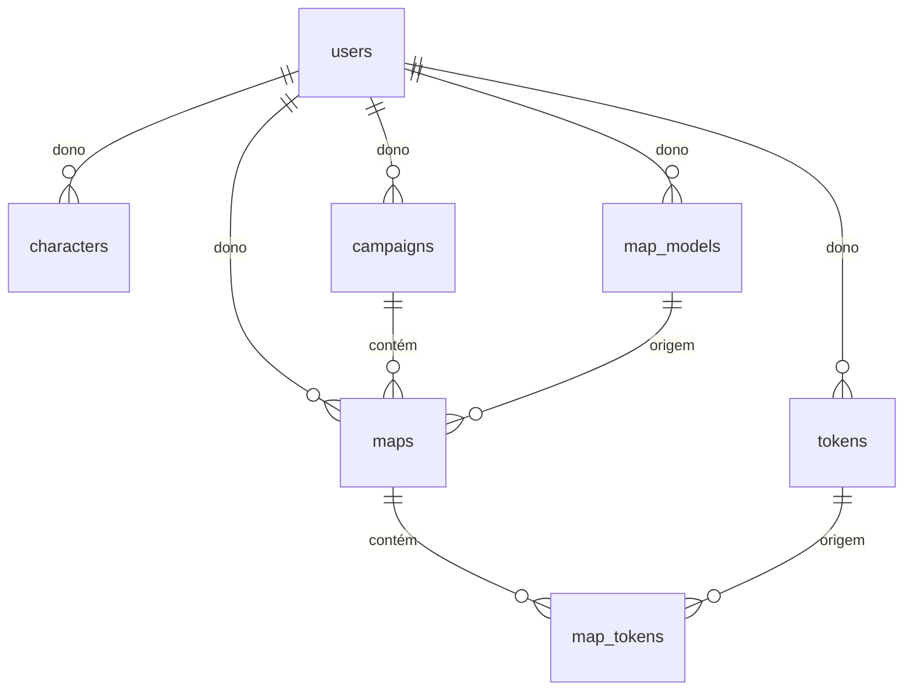

# Data Model: Backend das Entidades Principais

**Feature**: 001-backend-core-entities | **Date**: 2026-09-24

Convenções (constituição, Princípio V): tabelas snake_case no plural, PK `{entidade}_id`
bigint identity, constraint `{tabela}_pkey`, FK `fk_{pai}_{filho}` com `ClientSetNull`,
timestamps `timestamp without time zone` (UTC), strings `varchar(n)`, enums `integer`.

## Diagrama



## Enums (Domain/Enums)

| Enum | Valores |
|---|---|
| `MapStatus` | Active = 1, Archived = 2, Deleted = 3 |
| `MapTokenType` | Character = 1, Npc = 2, Enemy = 3, Object = 4 |

## users

| Coluna | Tipo | Regras |
|---|---|---|
| `user_id` | bigint identity | PK `users_pkey` |
| `name` | varchar(260) | obrigatório, 1–260 caracteres |
| `email` | varchar(260) | obrigatório, formato válido, salvo em minúsculas, índice único `ix_users_email` |
| `password_hash` | varchar(500) | obrigatório; hash PBKDF2; nunca sai da API |
| `created_at` | timestamp | default `now()` |
| `updated_at` | timestamp | atualizado em rename/troca de senha |

Regras: senha com mínimo 8 caracteres (validada antes do hash). Troca de senha exige a senha
atual correta. Rename altera só `name`.

## characters

| Coluna | Tipo | Regras |
|---|---|---|
| `character_id` | bigint identity | PK `characters_pkey` |
| `user_id` | bigint | FK `fk_user_character` → users, obrigatório (dono) |
| `name` | varchar(260) | obrigatório |
| `sheet` | varchar(20000) | opcional, markdown |
| `life` | integer | default 0; aceita negativo |
| `energy` | integer | default 0; aceita negativo |
| `status` | varchar(260) | opcional, texto livre |
| `move` | integer | default 0; ≥ 0 |
| `image` | varchar(260) | opcional; nome do arquivo no S3 |
| `created_at` / `updated_at` | timestamp | |

Regras: listagem filtra por `user_id` do usuário autenticado; alterar/excluir só pelo dono.

## tokens

| Coluna | Tipo | Regras |
|---|---|---|
| `token_id` | bigint identity | PK `tokens_pkey` |
| `user_id` | bigint | FK `fk_user_token`, obrigatório (dono) |
| `name` | varchar(260) | obrigatório |
| `description` | varchar(2000) | opcional |
| `up_space` | integer | default 1; ≥ 0 |
| `down_space` | integer NULL | ≥ 0; vazio = token sem estado deitado; 2 quando há `down_image` e nada foi informado (feature 003 — ver `specs/003-token-optional-down/data-model.md`) |
| `up_image` | varchar(260) | opcional; arquivo S3 |
| `down_image` | varchar(260) | opcional; arquivo S3 |
| `created_at` / `updated_at` | timestamp | |

Regras: listagem/busca de todos os usuários; alterar/excluir só pelo dono; exclusão bloqueada
(409) se houver `map_tokens` com este `token_id`.

## campaigns

| Coluna | Tipo | Regras |
|---|---|---|
| `campaign_id` | bigint identity | PK `campaigns_pkey` |
| `user_id` | bigint | FK `fk_user_campaign`, obrigatório (dono) |
| `name` | varchar(260) | obrigatório |
| `created_at` / `updated_at` | timestamp | |

Regras: listagem e leitura só do dono; alterar só o nome; exclusão bloqueada (409) com mapas
Active/Archived; mapas Deleted e seus map_tokens são removidos fisicamente junto com a
campanha, em uma transação.

## map_models

| Coluna | Tipo | Regras |
|---|---|---|
| `map_model_id` | bigint identity | PK `map_models_pkey` |
| `user_id` | bigint | FK `fk_user_map_model`, obrigatório (dono) |
| `name` | varchar(260) | obrigatório |
| `description` | varchar(2000) | opcional |
| `image` | varchar(260) | opcional; arquivo S3 |
| `created_at` | timestamp | definido na criação, nunca alterado |
| `changed_at` | timestamp | atualizado a cada alteração (nome pedido na spec: ChangedAt) |
| `grid_width`, `grid_height`, `image_width`, `image_height`, `image_top`, `image_left` | integer | adicionadas na feature 002 — ver `specs/002-mapmodel-grid-layout/data-model.md` |

Regras: listagem/busca de todos; alterar/excluir só pelo dono; exclusão bloqueada (409) se
algum mapa (qualquer status) usa o modelo.

## maps

| Coluna | Tipo | Regras |
|---|---|---|
| `map_id` | bigint identity | PK `maps_pkey` |
| `campaign_id` | bigint | FK `fk_campaign_map`, obrigatório |
| `map_model_id` | bigint | FK `fk_map_model_map`, obrigatório |
| `user_id` | bigint | FK `fk_user_map`, obrigatório (dono = dono da campanha) |
| `sequence` | integer | ≥ 1; índice único `ix_maps_campaign_model_sequence (campaign_id, map_model_id, sequence)` |
| `name` | varchar(260) | gerado `"{map_model.name} {sequence}"`; editável |
| `status` | integer | `MapStatus`, default 1 |
| `created_at` / `updated_at` | timestamp | |

Transições de status:

```text
Active ⇄ Archived      (PUT pelo dono)
Active | Archived → Deleted   (DELETE pelo dono; terminal)
Deleted → *            (proibido: mapa excluído não pode ser alterado)
```

Regras: só o dono da campanha cria mapas nela; listagem da campanha exclui Deleted e só o dono
da campanha lista; `PUT` aceita `name` e `status` ∈ {Active, Archived}.

## map_tokens

| Coluna | Tipo | Regras |
|---|---|---|
| `map_token_id` | bigint identity | PK `map_tokens_pkey` |
| `map_id` | bigint | FK `fk_map_map_token`, obrigatório |
| `token_id` | bigint | FK `fk_token_map_token`, obrigatório |
| `name` | varchar(260) | obrigatório; se vazio na inclusão, usa o nome do token |
| `token_type` | integer | `MapTokenType`, obrigatório |
| `sheet` | varchar(20000) | opcional, markdown |
| `life` | integer | default 0 |
| `energy` | integer | default 0 |
| `status` | varchar(260) | opcional |
| `move` | integer | default 0; ≥ 0 |
| `x` | integer | coluna da grid (odd-q), default 0 — era `q` axial até a feature 004 |
| `y` | integer | linha da grid, default 0 — era `r` axial até a feature 004 |
| `look` | integer | lado do hexágono para onde o token olha, 0..5, default 0 (feature 004 — ver `specs/004-maptoken-position-look/data-model.md`) |
| `created_at` / `updated_at` | timestamp | |

Regras: listar, incluir, alterar e excluir só pelo dono do mapa; mapa Deleted não aceita
operações; valores são cópias independentes do token da biblioteca. Vários tokens podem ocupar
o mesmo hexágono (sem regra de colisão nesta feature).

## DTOs (Roll6.DTO)

Todas as propriedades com `[JsonPropertyName("camelCase")]`. Imagens saem como
`{campo}` (nome do arquivo) + `{campo}Url` (presigned URL).

| Entidade | Leitura | Entrada |
|---|---|---|
| User | `UserInfo` (userId, name, email) | `UserInsertInfo` (name, email, password), `UserLoginInfo`, `UserNameInfo`, `UserPasswordInfo` (currentPassword, newPassword), `UserTokenInfo` (token, expiresAt, user) |
| Character | `CharacterInfo` | `CharacterInsertInfo` (também usado no update) |
| Token | `TokenInfo` | `TokenInsertInfo` |
| Campaign | `CampaignInfo` | `CampaignInsertInfo` (name) |
| MapModel | `MapModelInfo` | `MapModelInsertInfo` |
| Map | `MapInfo` (inclui mapModelName, campaignId) | `MapInsertInfo` (campaignId, mapModelId), `MapUpdateInfo` (name, status) |
| MapToken | `MapTokenInfo` (inclui tokenName, upImageUrl, downImageUrl) | `MapTokenInsertInfo` (mapId, tokenId, …, x, y, look), `MapTokenUpdateInfo` |
| Transversais | `PagedList<T>` (items, page, pageSize, totalCount), `ImageUploadInfo` (fileName, url) | |
